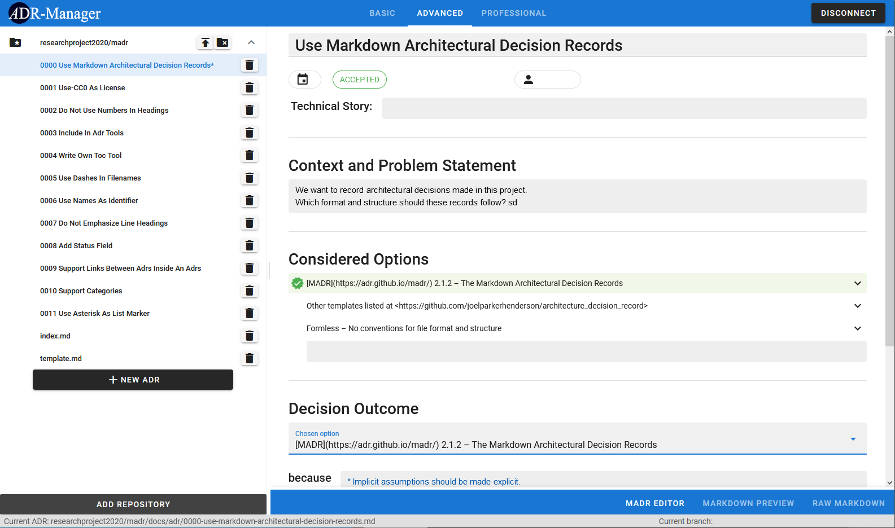

# ADR-Manager  [](https://github.com/adr/adr-manager/blob/main/LICENSE) [](https://github.com/adr/adr-manager/commits/main) [](https://github.com/adr/adr-manager/issues) [](https://github.com/adr/adr-manager/stargazers)

> A web-based application for the efficient creation and management of [architectural decision records (ADRs)](https://adr.github.io) in Markdown (MADR)


## Description

[MADR](https://adr.github.io/madr/) is a markdown template for quickly capturing architectural decisions.
It offers a naming scheme and template to keep the layout of recorded decisions consistent. 
Each decision is stored in a separate file.
The ADR Manager currently only supports the management of MADRs stored in the folder `docs/adr` in GitHub repositories.

## Quick start

You can find the tool at https://adr.github.io/adr-manager.

## Supported browsers

Currently, our tool has been successfully tested in Chrome, Firefox and Opera.

### Usage

1. After opening the tool, connect to GitHub. 
    - The tool needs your permission to access your GitHub repositories and E-Mail-address.
2. Add a GitHub repository.
3. Now, you can edit any files in `docs/adr` of the GitHub repository. Edit existing ADRs or create new ones. 
   One of the most important features is the MADR Editor that allows you to quickly draft a MADR while ensuring a consistent format.
   
4. Don't forget to push your changes to GitHub, once you're done with editing the files.

Some technical notes:
- The `authID` which enables the connection to GitHub and changes to ADRs are stored in the local storage. 
  That way they are not lost when you reload the page or restart the browser. 
  However, changes will be lost when you either
    - Clear local storage.
    - Press the `Disconnect` button.
  
  The general idea is that you directly push your changes to GitHub after editing.
- During development, we may remove permissions for the OAuth App from time to time. 
  Don't be surprised, if you have to give permissions repeatedly. 


## Development

### Prerequisites

- Node.js and npm
- A GitHub account with access to a repository with MADRs

### Installation

To run the project locally, follow these steps:

1. Clone this repository.
2. Install dependencies with `npm install`.
3. Compile and start the application with `npm run serve`.

Note that, even when you run it locally, you need to connect to GitHub to use any functionality.

### Useful Commands

The following commands are useful for development:

```bash
# install dependencies
npm install

# build and start with hot-reload for development
npm run serve

# build and minify for production
npm run build

# lint with auto-fix
npm run lint

# run unit tests
npm run test

# run e2e tests
npm run e2e:test

# open cypress UI for e2e tests
npx cypress open

# run a single e2e test
npx cypres run --spec ./cypress/integration/adrManagerTest/<file-name>
```

### Backend Setup

The project uses [Pizzly](https://github.com/bearer/pizzly) for the authentication to GitHub.
Our Pizzly instance is hosted on Heroku. 
If you do not want to use this instance, you can easily set up your own by following these steps:

1. Create an OAuth application on GitHub (see [here](https://docs.github.com/en/github-ae@latest/developers/apps/creating-an-oauth-app)).
   - Copy the Client ID and Client Secret of the app (you'll need them later).
   - Set the callback URL to `https://[your-app-name].herokuapp.com/auth/callback`, where `[your-app-name]` is the name of the Heroku app you'll create in the next step.
1. Deploy your own Pizzly instance on Heroku as described at https://github.com/bearer/pizzly.
2. Configure the deployed Pizzly instance.
   - Open the Pizzly dashboard (https://[your-app-name].herokuapp.com).
   - Add a new API and choose `GitHub`, then create a new configuration for it.
   - Enter the `Client ID` and `Client Secret` of your GitHub OAuth app.
   - As `scopes`, enter `repo`.
   - Also, consider [securing your Pizzly instance](https://github.com/Bearer/Pizzly/blob/master/docs/securing-your-instance.md).
3. Update `src/config.js` with the connection details of your Pizzly instance:
   - Set `pizzlyHost` to the base URL of your Pizzly instance, e.g. `https://[your-app-name].herokuapp.com/`.
   - If you secured Pizzly: set `pizzlyPublishableKey` to your publishableKey.

## Project Context

This project was started as an undergraduate research project at the Institute of Software Engineering of the University of Stuttgart, Germany.
It was also submitted to the [ICSE Score Contest 2021](https://conf.researchr.org/home/icse-2021/score-2021).
Since then, it has been given over to the [ADR organization on GitHub](https://github.com/adr), where it is maintained and extended.
